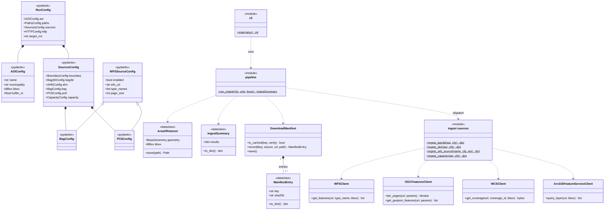

# Architecture — `rsgt` Stage 0 ingest

This document describes the structure of the `rsgt` (Rooftop Solar Grid-Twin) package as
implemented in P0: the **Stage 0 ingest pipeline** that resolves an area of interest (AOI)
and fetches every enabled Dutch open-data source into a reproducible local dataset.

## UML class diagram



> The diagram is generated from [`architecture.mmd`](architecture.mmd). See
> [Regenerating the diagram](#regenerating-the-diagram) below. If the embedded SVG does
> not render in your viewer, the same source is included as a Mermaid block at the end of
> this file (GitHub renders it inline).

## How to read it

The code splits into five packages, shown as the labelled boxes in the diagram.

### `config` — typed run-configuration ([`src/rsgt/config`](../src/rsgt/config))

Pydantic models that validate a single YAML run-config ([`schema.py`](../src/rsgt/config/schema.py),
loaded by [`loader.py`](../src/rsgt/config/loader.py)). The shape is a **composition tree**:

- `RunConfig` owns `AOIConfig`, `PathsConfig`, `HTTPConfig` and `SourcesConfig`.
- `SourcesConfig` owns the six per-source configs (`BoundaryConfig`, `Bag3DConfig`,
  `AHNConfig`, `BagConfig`, `PC6Config`, `CapacityConfig`).
- The only inheritance is `BagConfig` and `PC6Config` extending `WFSSourceConfig` — they
  differ only in their default WFS URL and feature type.

### `clients` — service protocol clients ([`clients.py`](../src/rsgt/ingest/clients.py))

Four stateless clients, each wrapping a shared `requests.Session`. They know a *protocol*,
not a *source* — the URLs and layer names live in `config`:

| Client | Protocol | Used for |
| --- | --- | --- |
| `WFSClient` | OGC WFS 2.0 | BAG, PC6 |
| `OGCFeaturesClient` | OGC API Features | 3D BAG, municipality boundary |
| `ArcGISFeatureServiceClient` | ArcGIS Feature Service | Netbeheer capaciteitskaart |
| `WCSClient` | OGC WCS 2.0.1 | AHN DSM/DTM rasters |

### `domain` — value objects (dataclasses)

- `AreaOfInterest` ([`aoi.py`](../src/rsgt/ingest/aoi.py)) — the resolved AOI geometry +
  bbox in RD New (EPSG:28992); bounds every query and clips vector results.
- `Paths` and `IngestSummary` ([`pipeline.py`](../src/rsgt/ingest/pipeline.py)) — the
  directory layout and the machine-readable run summary.

### `manifest` — reproducible caching ([`manifest.py`](../src/rsgt/ingest/manifest.py))

`DownloadManifest` is the one stateful class (private entry map + lock). It composes
`0..*` `ManifestEntry` records — each downloaded artefact's URL, params, sha256, byte size
and timestamp — so re-runs skip work whose output is already present and intact.

### `runtime` — orchestration (module-level functions)

Behaviour lives in functions, not classes, so each module is shown as a `«module»` box with
its functions as static operations:

- [`cli.py`](../src/rsgt/cli.py) — `rsgt ingest` / `rsgt aoi` argument parsing and entry point.
- [`pipeline.py`](../src/rsgt/ingest/pipeline.py) — `run_ingest()` orchestrates a run.
- [`aoi.py`](../src/rsgt/ingest/aoi.py) — `resolve_aoi()` (municipality boundary or bbox).
- [`download.py`](../src/rsgt/ingest/download.py) — `build_session()`, `download_file()`.
- ingest sources — `ingest_bag3d`, `ingest_ahn`, `ingest_bag`, `ingest_pc6`,
  `ingest_capacity`, plus the shared `ingest_wfs_source` in
  [`vector.py`](../src/rsgt/ingest/vector.py) that BAG and PC6 delegate to.
- [`geo/crs.py`](../src/rsgt/geo/crs.py) — CRS constants and bbox helpers.

## Runtime flow

```text
rsgt ingest --config configs/oudewater.yaml
        │
        ▼
cli._cmd_ingest ──> load_config() ─> RunConfig
        │
        ▼
pipeline.run_ingest(cfg)
        ├─ resolve_aoi() ─────────────> AreaOfInterest   (via OGCFeaturesClient)
        ├─ build_session() ───────────> requests.Session
        ├─ DownloadManifest(raw/manifest.json)
        └─ for each enabled source: dispatch ──┐
                                               ▼
        ingest_bag3d  ─> OGCFeaturesClient        (CityJSONSeq)
        ingest_ahn    ─> WCSClient                (DSM/DTM GeoTIFF, tiled + mosaicked)
        ingest_bag    ─┐
        ingest_pc6    ─┴> ingest_wfs_source ─> WFSClient   (GeoPackage)
        ingest_capacity ─> ArcGISFeatureServiceClient      (held-out validation)
                                               │
                                               ▼
        IngestSummary ─> processed/ingest_summary.json
```

Each source runs independently; a per-source failure is captured in the `IngestSummary`
(not raised) so one flaky service does not abort the whole run.

## Regenerating the diagram

The diagram source of truth is [`architecture.mmd`](architecture.mmd). Render it to SVG with
[`@mermaid-js/mermaid-cli`](https://github.com/mermaid-js/mermaid-cli):

```bash
# Uses a local Chrome instead of downloading Chromium (see docs/.puppeteer.json —
# adjust executablePath for your machine).
PUPPETEER_SKIP_DOWNLOAD=1 \
npx -y @mermaid-js/mermaid-cli@10 \
  -i docs/architecture.mmd -o docs/architecture.svg \
  -p docs/.puppeteer.json -b transparent
```

<details>
<summary>Mermaid source (renders inline on GitHub)</summary>



</details>
